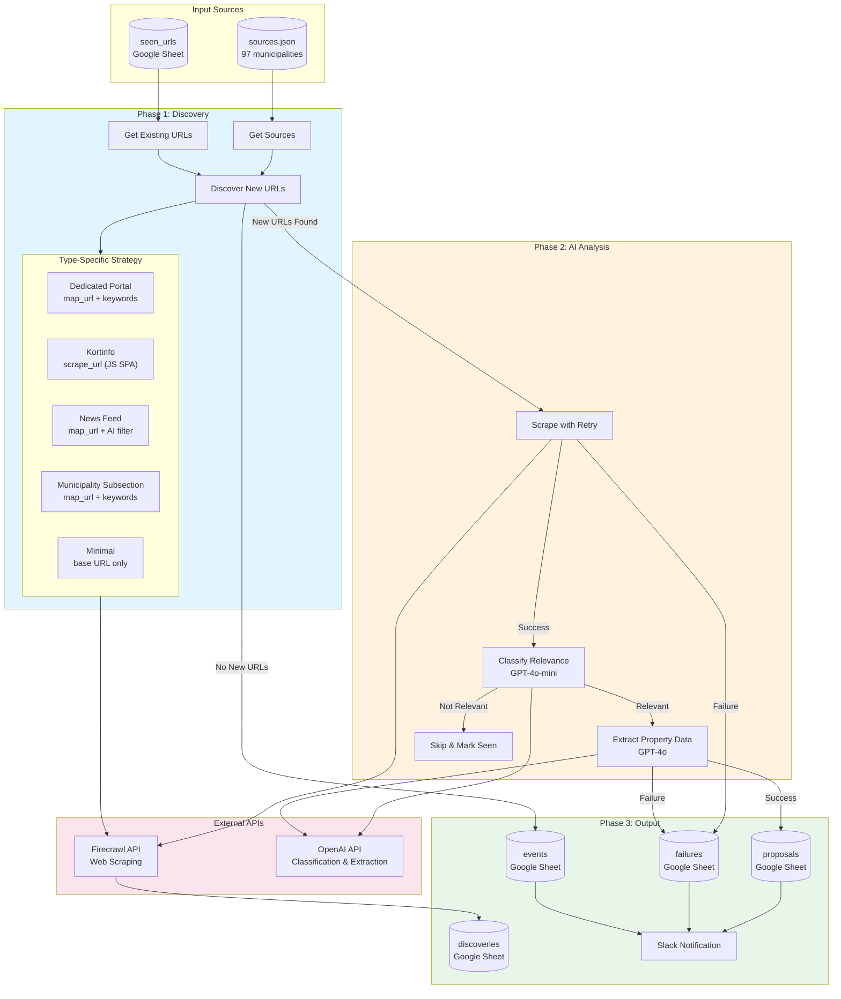
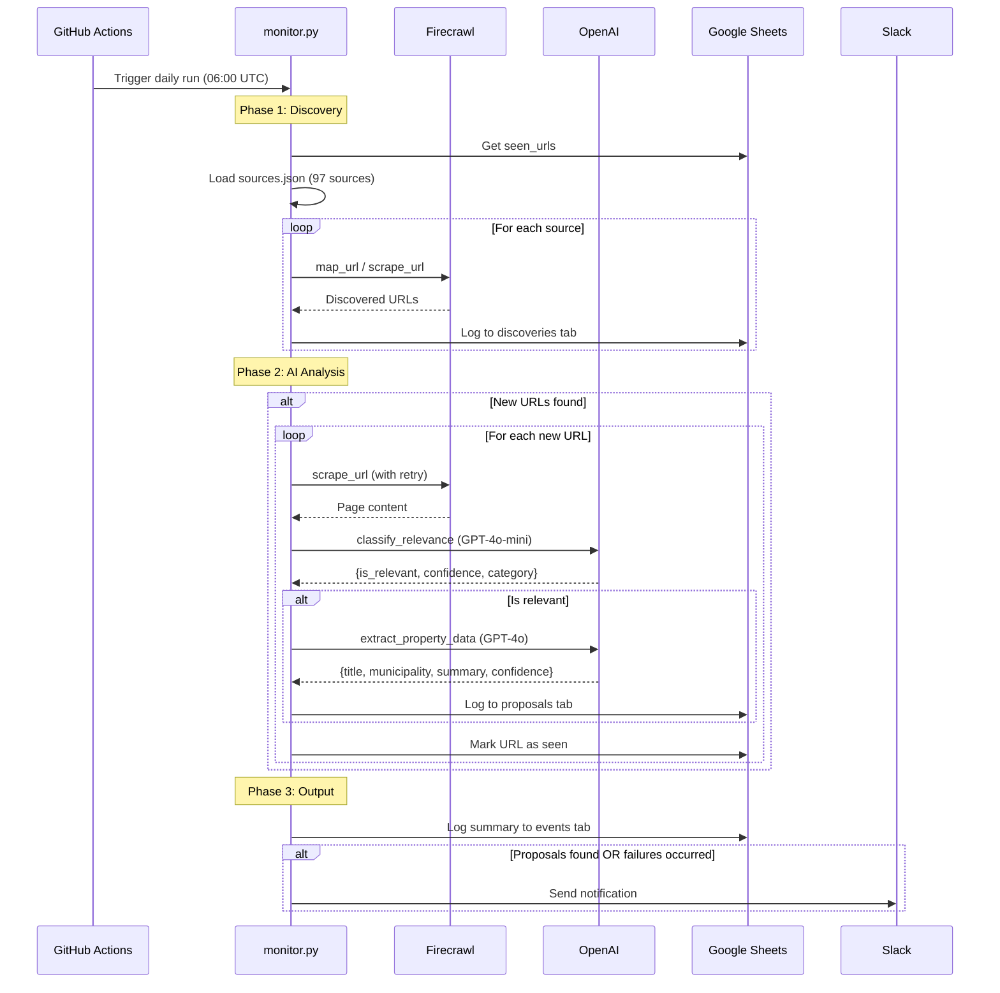

# Kommunal Grundsalg Monitor

Automated monitoring system that discovers and extracts property sale announcements ("grundsalg") from Danish municipality websites. Runs daily via GitHub Actions, stores results in Google Sheets, and sends Slack notifications.

## Overview

Danish municipalities publish land and property sales across 97+ different websites with varying structures. This system automates the discovery and extraction process that previously required ~10 hours/month of manual monitoring.

### Key Features

- **97 municipality sources** monitored daily
- **5 website type classifications** with tailored scraping strategies
- **Two-stage AI filtering** for cost efficiency (80% cost reduction)
- **Slack notifications** for new proposals and failures
- **Comprehensive failure tracking** with retry logic
- **Google Sheets integration** for easy data access

## System Architecture



## Processing Flow



## Quick Start

### Prerequisites

- Python 3.9+
- Firecrawl API key ([firecrawl.dev](https://firecrawl.dev))
- OpenAI API key ([platform.openai.com](https://platform.openai.com))
- Google Sheet with Apps Script webhook
- (Optional) Slack workspace with paid plan for Workflow Builder

### Installation

```bash
# Clone repository
git clone https://github.com/your-org/kommunal-grundsalg-monitor.git
cd kommunal-grundsalg-monitor

# Install dependencies
pip install -r requirements.txt

# Create environment file
cp env.local.example env.local
# Edit env.local with your API keys
```

### Configuration

Create `env.local` file:
```bash
FIRECRAWL_API_KEY=fc-your-key-here
OPENAI_API_KEY=sk-your-key-here
SHEETS_WEBAPP_URL=https://script.google.com/macros/s/your-script-id/exec
SLACK_WEBHOOK_URL=https://hooks.slack.com/triggers/your/webhook/url  # Optional
```

### Run Locally

```bash
python monitor.py
```

### GitHub Actions Setup

Add these secrets to your repository:
- `FIRECRAWL_API_KEY`
- `OPENAI_API_KEY`
- `SHEETS_WEBAPP_URL`
- `SLACK_WEBHOOK_URL`

The workflow runs automatically daily at 06:00 UTC.

## Google Sheets Setup

Create a Google Sheet with these tabs:

| Tab | Columns |
|-----|---------|
| `discoveries` | timestamp, source_id, source_name, url, source_type |
| `proposals` | timestamp, municipality, title, url, confidence, summary, published_date |
| `seen_urls` | url, timestamp |
| `events` | timestamp, type, title, description, col5, col6, col7, col8 |
| `failures` | timestamp, url, source_id, failure_type, error_message |

Deploy the Apps Script from `apps-script.gs` as a web app.

## Slack Integration

Uses Slack Workflow Builder (requires paid Slack plan):

1. Create new workflow with "From a webhook" trigger
2. Add variables: `message` (text), `proposals_count` (text), `details` (text)
3. Add "Send a message to channel" step
4. Publish and copy webhook URL

## Cost Breakdown

### Monthly Operating Costs

| Service | Cost | Notes |
|---------|------|-------|
| Firecrawl | ~$83/mo | Standard plan (100k credits) |
| OpenAI | ~$20-60/mo | Depends on URL volume |
| Google Sheets | Free | Via Apps Script |
| Slack | Free | Included in paid plan |
| GitHub Actions | Free | Within free tier limits |
| **Total** | **~$103-143/mo** | |

### Per-Run Cost Estimate

| Operation | Credits/Calls | Cost |
|-----------|---------------|------|
| Firecrawl Discovery | ~97 map calls | ~97 credits |
| Firecrawl Scraping | ~200 scrapes | ~200 credits |
| OpenAI Classification | ~200 calls | ~$0.10 |
| OpenAI Extraction | ~50 calls | ~$1.21 |
| **Total per run** | | **~$1.31 + 297 credits** |

### Cost Optimization

The system already implements several optimizations:

1. **Two-stage AI filtering** - GPT-4o-mini for classification ($0.15/1M tokens) before GPT-4o extraction ($2.50/1M tokens)
2. **Deduplication** - URLs only processed once via `seen_urls`
3. **Conditional AI analysis** - Skipped entirely if no new URLs found

Future optimizations:
- Reduce `map_url` limits for stable sources
- Implement caching for frequently accessed pages
- Batch multiple pages into single AI calls

## Website Type Classification

| Type | Count | Discovery Method | Use Case |
|------|-------|------------------|----------|
| `dedicated_portal` | 15 | map_url with keywords | Well-structured grundsalg sites |
| `kortinfo` | 10 | scrape_url with link extraction | JavaScript SPAs |
| `news_feed` | 5 | map_url + AI classification | Mixed news/property content |
| `municipality_subsection` | 65 | map_url with keywords | Standard municipality pages |
| `minimal` | 2 | scrape base URL only | Rarely updated sites |

## File Structure

```
kommunal-grundsalg-monitor/
├── monitor.py              # Main orchestration script
├── sheets.py               # Google Sheets API wrapper
├── sources.json            # 97 municipality sources
├── requirements.txt        # Python dependencies
├── env.local               # Environment variables (not committed)
├── apps-script.gs          # Google Apps Script for Sheets
├── .github/
│   └── workflows/
│       └── daily-monitor.yml
├── CLAUDE.md               # AI assistant guidance
├── README.md               # This file
├── PROJECT_HISTORY.md      # Development history
└── prd.md                  # Product requirements
```

## Example Output

### Slack Notification (Success)
```
🏠 Grundsalg Monitor: Found 5 new property listings today!

• Aarhus: Parcelhusgrunde i Lisbjerg (92% confidence)
  https://grundsalg.aarhus.dk/grund/123

• Odense: Erhvervsgrunde ved motorvej (85% confidence)
  https://grundsalg.kortinfo.net/odense/456

• Køge: Byggegrunde til salg (78% confidence)
  https://koege.dk/byggegrunde/789
```

### Slack Notification (With Failures)
```
🏠 Grundsalg Monitor: 3 proposals, ❌ 2 failures

• Aarhus: Parcelhusgrunde (92% confidence)
  https://grundsalg.aarhus.dk/grund/123

❌ Failures (2):
  • Scrape: https://some-site.dk/timeout...
  • Extract: https://another-site.dk/error...
```

### Events Log Summary
```
Processed 97 sources | Discovered 45 URLs | Scraped 43/45 (2 failed) | Proposals: 12 | Skipped: 31 (not relevant) | ⚠️ Total failures: 2
```

## Troubleshooting

### Common Issues

| Issue | Solution |
|-------|----------|
| "Insufficient credits" from Firecrawl | Upgrade Firecrawl plan or wait for credit reset |
| No Slack notification | Verify webhook URL, check workflow is published |
| All URLs marked as irrelevant | Review classification keywords in `classify_relevance()` |
| "Firecrawl not initialized" | Check `FIRECRAWL_API_KEY` is set correctly |

### Manual Testing

```bash
# Test Slack notification
python3 -c "
from monitor import send_slack_notification
send_slack_notification('Test', [{'municipality': 'Test', 'title': 'Test', 'url': 'https://test.dk', 'confidence': 0.9}])
"

# Test classification
python3 -c "
from monitor import classify_relevance
print(classify_relevance('https://example.dk', 'Parcelhusgrund til salg'))
"
```

## Contributing

1. See [PROJECT_HISTORY.md](PROJECT_HISTORY.md) for development context
2. See [CLAUDE.md](CLAUDE.md) for technical documentation
3. Test locally before pushing changes
4. Update documentation for significant changes

## License

Proprietary - Resights ApS

---

*Built with Firecrawl, OpenAI, and GitHub Actions*
