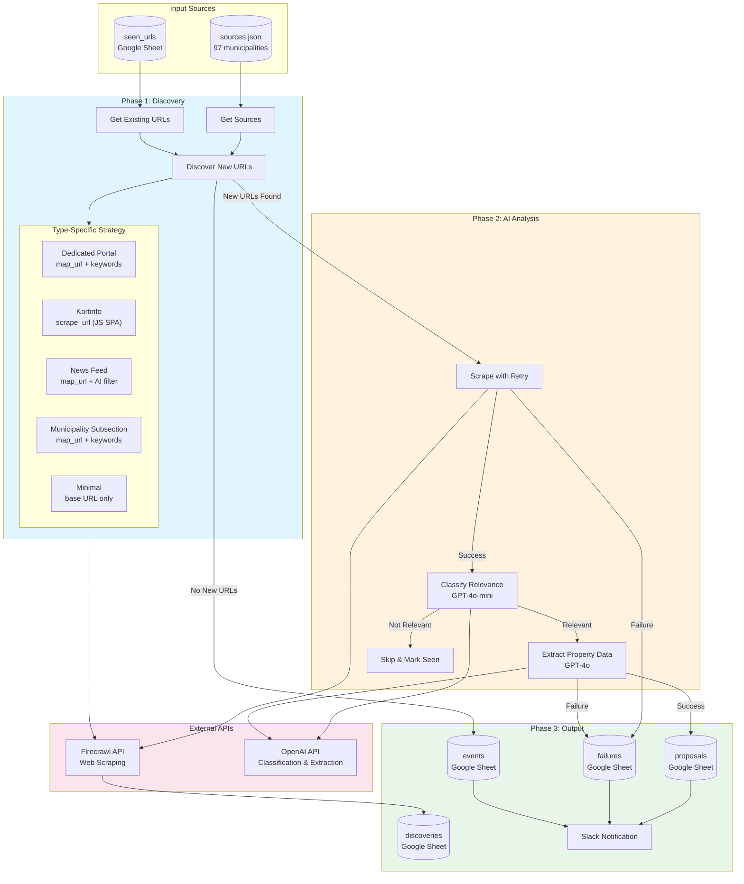

# System Architecture Flowchart

## Description

This flowchart shows the complete system architecture of the Kommunal Grundsalg Monitor:

### Input Sources
- **sources.json** - 97 municipality URLs with type classification
- **seen_urls** - Previously processed URLs for deduplication

### Phase 1: Discovery
- Loads sources and existing URLs
- Uses type-specific strategies for each website type:
  - Dedicated portals: `map_url` with property keywords
  - Kortinfo sites: `scrape_url` (JavaScript SPA workaround)
  - News feeds: `map_url` + AI classification filter
  - Municipality subsections: `map_url` with keywords
  - Minimal sites: Base URL only

### Phase 2: AI Analysis
- **Scrape with Retry** - Fetches page content with retry logic
- **Classify Relevance** - GPT-4o-mini determines if content is property-related
- **Extract Property Data** - GPT-4o extracts structured data from relevant pages

### Phase 3: Output
- **discoveries** - Raw Firecrawl findings (audit trail)
- **proposals** - AI-analyzed property listings
- **failures** - Error tracking
- **events** - System logs and heartbeat
- **Slack** - Notifications for proposals and failures

### External APIs
- **Firecrawl** - Web scraping and content extraction
- **OpenAI** - AI classification and data extraction
