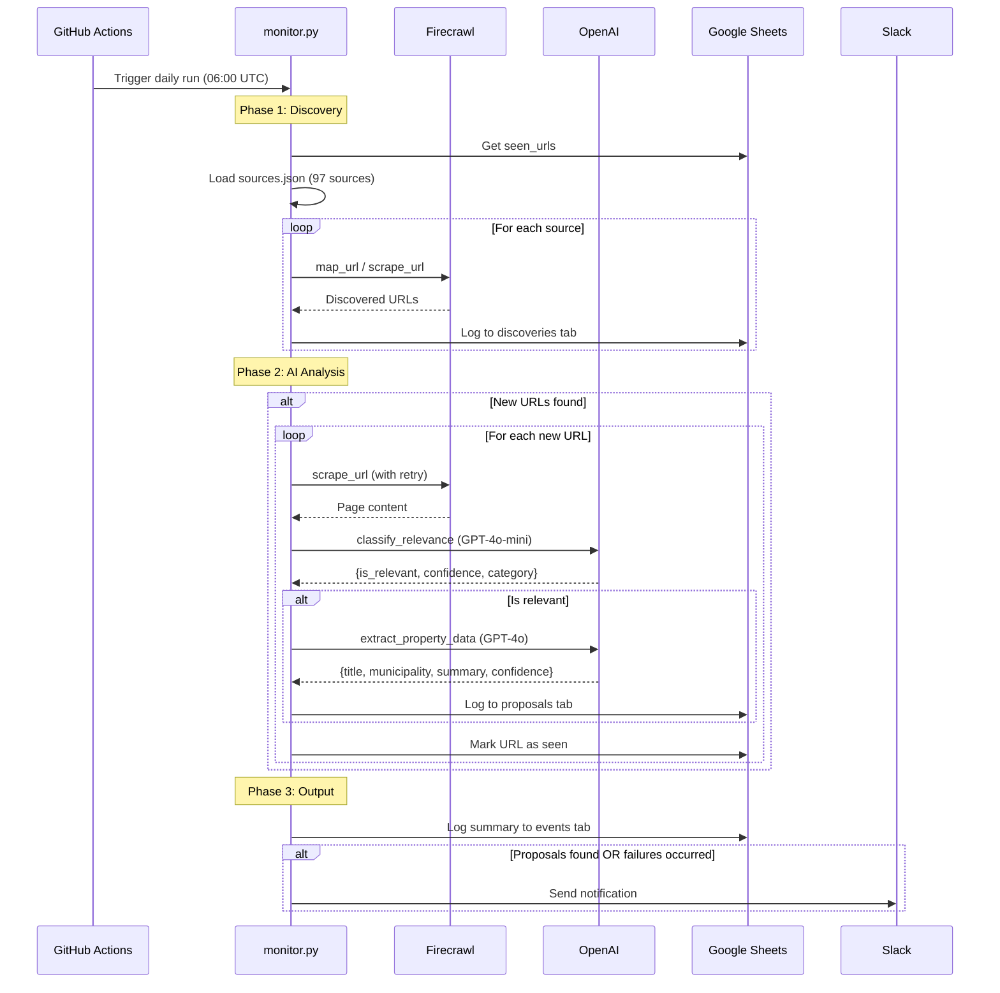

# Processing Flow Sequence Diagram

## Description

This sequence diagram shows the temporal flow of a single monitoring run:

### Trigger
- GitHub Actions triggers the monitor daily at 06:00 UTC
- Can also be triggered manually via workflow_dispatch

### Phase 1: Discovery
1. Load previously seen URLs from Google Sheets
2. Load 97 municipality sources from sources.json
3. For each source:
   - Call Firecrawl `map_url` or `scrape_url` (depending on website type)
   - Log all discovered URLs to `discoveries` tab

### Phase 2: AI Analysis
Only runs if new URLs were discovered:

1. For each new URL:
   - Scrape content with retry logic (max 1 retry)
   - Classify relevance using GPT-4o-mini
   - If relevant: Extract structured data using GPT-4o
   - Log to `proposals` tab if extraction succeeds
   - Mark URL as seen (regardless of outcome)

### Phase 3: Output
1. Log run summary to `events` tab
2. If proposals found OR failures occurred:
   - Send Slack notification with details

### Rate Limiting
- 4.5 seconds between Firecrawl API calls
- 5 seconds retry delay for failed requests

### Error Handling
- All failures logged to `failures` tab
- Failed URLs still marked as seen (prevents retry loops)
- Slack notification includes failure count
